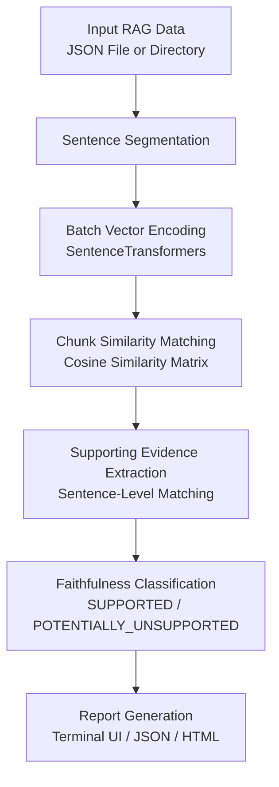

# Aegis

An open-source RAG faithfulness auditor that checks whether each sentence in a generated answer is supported by the retrieved context.

Aegis helps AI developers inspect unsupported claims, identify specific supporting evidence within retrieved chunks, and export structured audit reports.

---

## How Aegis Works



---

## Key Features

- **Sentence-Level Faithfulness Audit**: Splits generated answers into individual sentences and evaluates each claim against retrieved context chunks.
- **Supporting Evidence Extraction (v2.0.0)**: Identifies the exact supporting sentence within a retrieved context chunk that best backs each supported answer claim.
- **Batch Processing**: Recursively scans directories containing multiple JSON files in a single execution.
- **Vectorized Embedding Performance**: Uses batch matrix vectorization and sentence caching to minimize embedding model inference latency.
- **Multiple Report Formats**: Displays interactive Rich console tables and exports structured JSON, standalone HTML, and plain text reports.

---

## Supporting Evidence Feature

### What is Supporting Evidence?

When an answer sentence matches a retrieved context chunk above the similarity threshold ($\ge 0.75$ default), Aegis segments the chunk into individual sentences and isolates the single sentence that provides the closest semantic match. If a claim is unsupported or no chunk sentence meets the threshold, the evidence is reported as `None`.

### Example Output

```text
Answer Sentence:
"Guido van Rossum created Python."

Status:
SUPPORTED

Similarity:
0.9200

Best Matching Chunk:
"Python is a high-level programming language. It was created by Guido van Rossum. Python is widely used for AI."

Supporting Evidence:
"It was created by Guido van Rossum."
```

### Where to View Supporting Evidence

- **CLI Terminal**: Displayed in the `Supporting Evidence` column of the Rich analysis table during `aegis scan`.
- **JSON Report**: Saved in the `"supporting_evidence"` key of each result object.
- **HTML Report**: Exported in the `Supporting Evidence` table column of standalone HTML reports.
- **Text Report**: Rendered in plain text audit summaries under `Supporting Evidence: <text>`.

---

## Installation

```bash
pip install .
```

---

## Usage

### Single File Scan

Scan a single RAG input file containing `question`, `retrieved_chunks`, and `answer`:

```bash
aegis scan input.json --threshold 0.75
```

### Batch Directory Scan

Recursively scan all `.json` files in a directory:

```bash
aegis batch-scan ./inputs --threshold 0.75
```

---

## Input JSON Format

Input JSON files must contain an object with the following fields:

```json
{
  "question": "Who created Python?",
  "retrieved_chunks": [
    "Python is a high-level programming language. It was created by Guido van Rossum."
  ],
  "answer": "Guido van Rossum created Python."
}
```

---

## Project Status & Roadmap

| Version | Status | Key Focus |
|---------|--------|-----------|
| **v1.0.0** | Released | Core scanner engine, CLI, JSON/HTML reports, configuration system |
| **v2.0.0** | Released | Sentence-level evidence extraction, embedding performance reuse, report exports |
| **v3.0.0** | Planned | Evaluation benchmarks and framework integrations |
