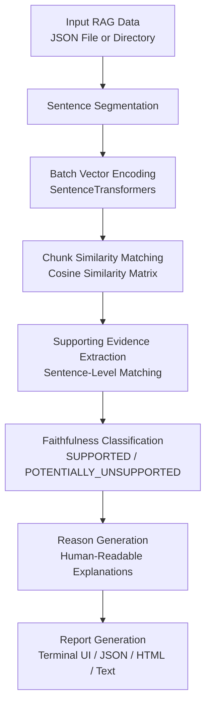

# Aegis

An open-source RAG faithfulness auditor that checks whether each sentence in a generated answer is supported by the retrieved context.

Aegis helps AI developers inspect unsupported claims, identify specific supporting evidence within retrieved chunks, generate clear explanations for unsupported statements, and export structured audit reports.

---

## How Aegis Works



---

## Key Features

- **Sentence-Level Faithfulness Audit**: Splits generated answers into individual sentences and evaluates each claim against retrieved context chunks.
- **Supporting Evidence Extraction (v2.0.0)**: Identifies the exact supporting sentence within a retrieved context chunk that best backs each supported answer claim.
- **Unsupported Claim Explanations (v3.0.0)**: Generates human-readable explanations describing why a sentence is unsupported (e.g. no retrieved context vs. context similarity below threshold).
- **Batch Processing**: Recursively scans directories containing multiple JSON files in a single execution.
- **Vectorized Embedding Performance**: Uses batch matrix vectorization and sentence caching to minimize embedding model inference latency.
- **Multiple Report Formats**: Displays interactive Rich console tables and exports structured JSON, standalone HTML, and plain text reports.

---

## Unsupported Reason Feature (v3.0.0)

### What is the Reason Field?

When an answer sentence is classified as `POTENTIALLY_UNSUPPORTED`, Aegis provides a clear, human-readable explanation describing why the claim could not be verified against the retrieved context:

1. **No Context Retrieved**: `"No relevant context was retrieved for this answer."` — returned when `retrieved_chunks` is empty or no context chunk is available.
2. **Insufficient Similarity**: `"A related context was retrieved, but no supporting evidence met the similarity threshold."` — returned when context was retrieved, but its semantic similarity score is below the configured threshold ($\text{default } 0.75$).

For `SUPPORTED` sentences, the reason field is reported as `None` (rendered as `—` in CLI and HTML reports).

### Example Output

```text
Answer Sentence:
"Unsupported claim about space travel."

Status:
POTENTIALLY_UNSUPPORTED

Similarity:
0.2500

Best Matching Chunk:
"Python is a high-level programming language."

Supporting Evidence:
None

Reason:
"A related context was retrieved, but no supporting evidence met the similarity threshold."
```

---

## Where to View Audit Results

- **CLI Terminal**: Displayed in `Supporting Evidence` and `Reason` columns of the Rich analysis table during `aegis scan`.
- **JSON Report**: Saved in `"supporting_evidence"` and `"reason"` keys of each result object.
- **HTML Report**: Exported in `Supporting Evidence` and `Reason` table columns of standalone HTML reports.
- **Text Report**: Rendered in plain text audit summaries under `Supporting Evidence: <text>` and `Reason: <text>`.

---

## Installation

```bash
pip install .
```

---

## Usage

### Single File Scan

Scan a single RAG input file containing `question`, `retrieved_chunks`, and `answer`:

```bash
aegis scan input.json --threshold 0.75
```

### Batch Directory Scan

Recursively scan all `.json` files in a directory:

```bash
aegis batch-scan ./inputs --threshold 0.75
```

---

## Input JSON Format

Input JSON files must contain an object with the following fields:

```json
{
  "question": "Who created Python?",
  "retrieved_chunks": [
    "Python is a high-level programming language. It was created by Guido van Rossum."
  ],
  "answer": "Guido van Rossum created Python."
}
```

---

## Project Status & Roadmap

| Version | Status | Key Focus |
|---------|--------|-----------|
| **v1.0.0** | Released | Core scanner engine, CLI, JSON/HTML reports, configuration system |
| **v2.0.0** | Released | Sentence-level evidence extraction, embedding performance reuse, report exports |
| **v3.0.0** | Released | Unsupported claim explanations, CLI & multi-report exports |
| **v4.0.0** | Planned  | Framework integrations and evaluation pipelines |
